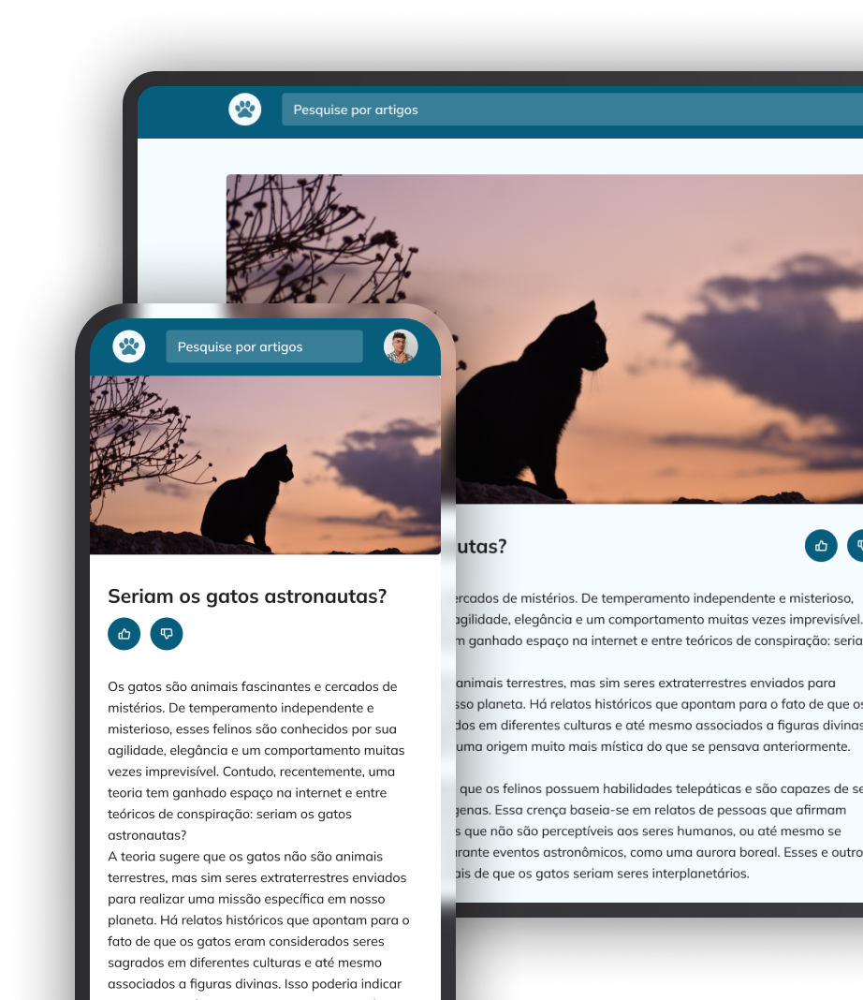

<h1 align="center"> Cat Blog </h1>

Rocketseat training challenge for teaching WEB technologies.

  <a href="#-tecnologias">Technologies</a>&nbsp;&nbsp;&nbsp;|&nbsp;&nbsp;&nbsp;
  <a href="#-projeto">Project</a>&nbsp;&nbsp;&nbsp;|&nbsp;&nbsp;&nbsp;
  <a href="#-layout">Layout</a>&nbsp;&nbsp;&nbsp;|&nbsp;&nbsp;&nbsp;
  <a href="#memo-licença">License</a>

  

 

<!-- Project image -->

  

## 🚀 Tecnologias

This project was developed with the following technologies:

- HTML e CSS
- Git e Github
- Figma

## 💻 Projeto

The project is a cat blog for studying display, flexible measurement units, variables, mobile first, HSL colors, animations (keyframes) and responsiveness.

## 🔖 Layout

You can view the project layout through[THIS LINK](https://www.figma.com/community/file/1256354927622258124). It is necessary to have an account[Figma](https://figma.com) to access it.

## :memo: Licença